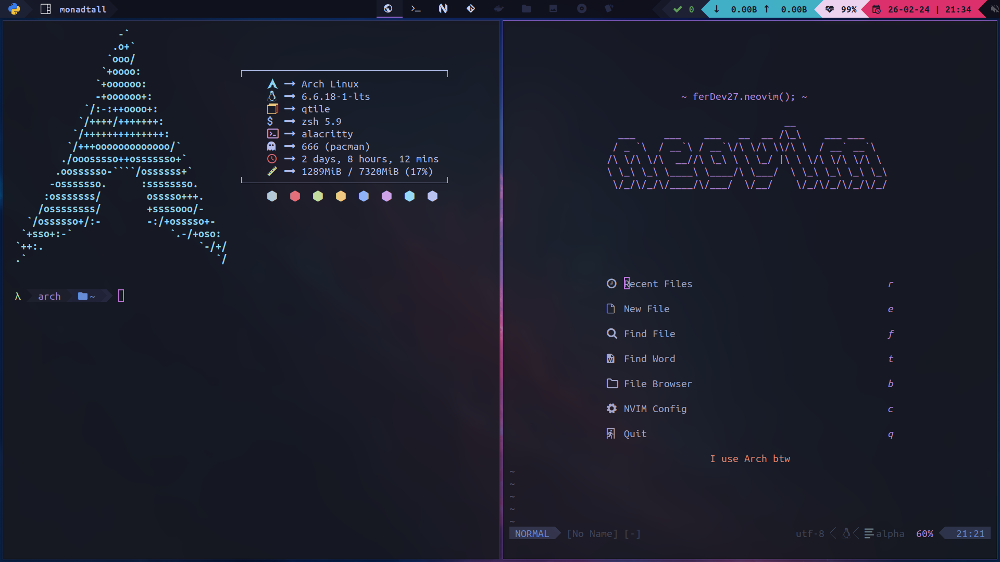
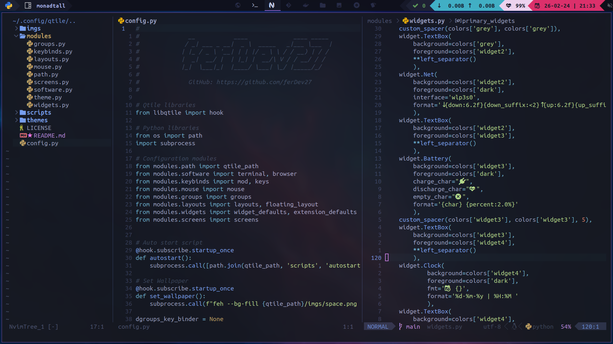

# ferDev27's config for Qtile 




# Contents
- [Installation](#installation)


# Instalation
Packages you will need

```bash
sudo pacman -S xorg neovim git firefox alacritty qtile base-devel
```

```bash
sudo pacman -S pacman-contrib alsa-utils lightdm lightdm-gtk-greeter rofi feh 
ttf-ubuntu-mono-nerd ttf-dejavu ttf-liberation noto-fonts noto-fonts-emoji 
brightnessctl volumeicon libnotify notification-daemon ranger unzip xcb-util-cursor 
lxappearance picom python-psutil redshift scrot sxiv mpv zathura zathura-ps 
zathura-pdf-poppler xclip xbanish jq tidy gpick imagemagick wmname
```

