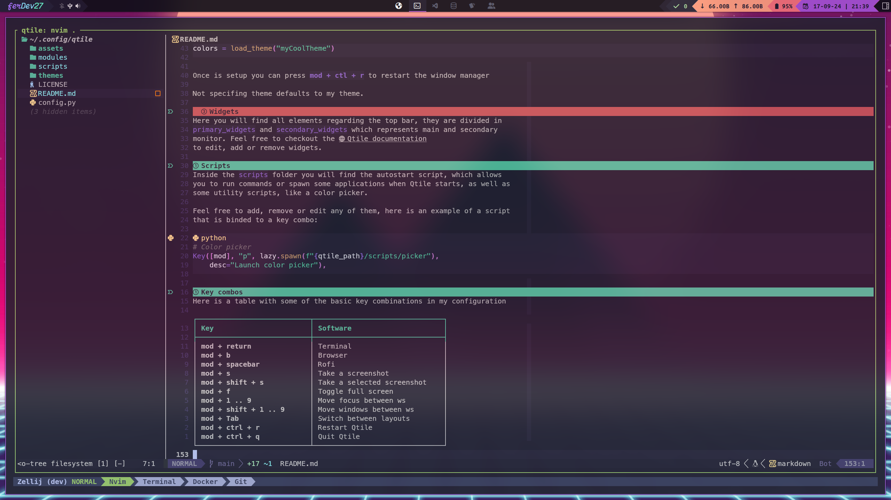

# ferDev27's config for Qtile 




Official [Qtile web](https://qtile.org/)

# Content
- [Installation](#installation)
- [Basics](#basics)
- [Scripts](#scripts)
- [Key combos](#key-combos)

# Instalation
Core packages:
```bash
sudo pacman -S xorg kitty qtile base-devel pacman-contrib python-psutil ttf-ubuntu-mono-nerd rofi feh redshift scrot alsa-utils picom gpick imagemagick wmname 
```

Software I use alongside the WM:
```bash
sudo pacman -S neovim git lightdm lightdm-gtk-greeter ttf-dejavu ttf-liberation noto-fonts noto-fonts-emoji brightnessctl volumeicon libnotify notification-daemon unzip xcb-util-cursor lxappearance sxiv mpv zathura zathura-ps zathura-pdf-poppler dunst xclip jq tidy yazi flameshot zellij kvantum kvantum-qt5
```

To use my config just copy my config into you .config folder, I will recommend to
backup your current one. 

```bash
git clone https://github.com/ferDev27/qtile.git
cp -r qtile ~/.config/
```

# Basics

## Project is divided into different modules
### Here are some of them:

### Groups
Here you have the workspaces that will appear in the top bar.

```python
workspaces = [" 󰇧  ", "   ", "   ", " 󰊢  ", "   ", "   ", " 󰋩  ", "   ", " 󰘸  "]
```
You can use whatever you want, I like to use nerdfont icons but feel free to 
change it for numbers, words or what ever fits you best.

i.e
```python
workspaces = ["1", "2", "3", "4", "5", "6", "7", "8", "9"]
```

### Keybinds
In [this section](#key-combos) you have some basic keybinds that will get you 
started, here you can change any keybind or the leader key, in my case I like to
use the **``super``** key.

### Layouts
Here you have the different layouts, just comment or uncoment regarding your
preferences. You can use **``mod + Tab``** or **``mod + shift + Tab``** to move 
between them.

### Software
Here you can set the variables for the software that you use, if you want to add
some new program you can store the name into a variable, then import it on the 
**keybinds module** like so:

```python
from .software import terminal, browser
```

and assign it to the desire key combo

```python
# Browser
Key([mod], "b", lazy.spawn(browser), 
    desc="Launch browser"),
```

### Themes
Themes are store as json files inside ``.config/qtile/themes``, if you want to 
switch to a new theme make sure the json file exist. 

i.e

``.config/qtile/themes/myCoolTheme.json`` 

I recommend taking one of the existing ones and edit it to your liking. To set 
it up, pass the name of your theme to the following function which is located in 
``.config/qtile/modules/theme.py``

```python
# Set color scheme
colors = load_theme("myCoolTheme")
```

Once is setup you can press **``mod + ctl + r``** to restart the window manager  

Not specifing theme defaults to my theme.

### Widgets
Here you will find all elements regarding the top bar, they are divided in 
``primary_widgets`` and ``secondary_widgets`` which represents main and secondary
monitor. Feel free to checkout the [Qtile documentation](https://docs.qtile.org/en/stable/manual/ref/widgets.html) 
to edit, add or remove widgets.

# Scripts
Inside the ``scripts`` folder you will find the autostart script, which allows 
you to run commands or spawn some applications when Qtile starts, as well as 
some utility scripts, like a color picker.

Feel free to add, remove or edit any of them, here is an example of a script 
that is binded to a key combo:

```python
# Color picker
Key([mod], "p", lazy.spawn(f"{qtile_path}/scripts/picker"), 
    desc="Launch color picker"),
```

# Key combos
Here is a table with some of the basic key combinations in my configuration

| Key                       | Software                      |
| ------------------------- | ------------------------------|
| **mod + return**          | Terminal                      |
| **mod + b**               | Browser                       |
| **mod + spacebar**        | Rofi                          |
| **mod + s**               | Take a screenshot             |
| **mod + shift + s**       | Take a selected screenshot    |
| **mod + f**               | Toggle full screen            |
| **mod + 1 .. 9**          | Move focus between ws         |
| **mod + shift + 1 .. 9**  | Move windows between ws       |
| **mod + Tab**             | Switch between layouts        |
| **mod + ctrl + r**        | Restart Qtile                 |
| **mod + ctrl + q**        | Quit Qtile                    |

